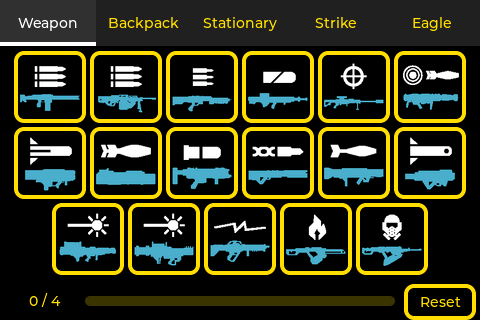
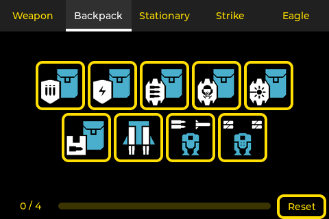
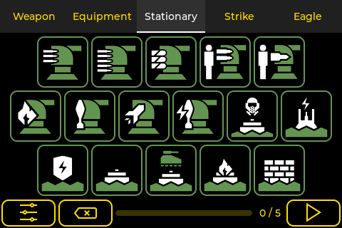
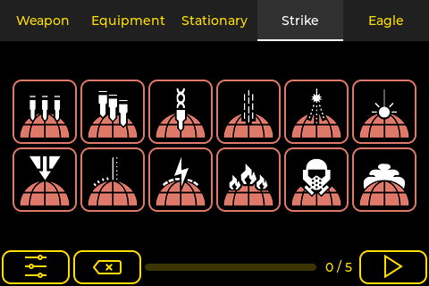
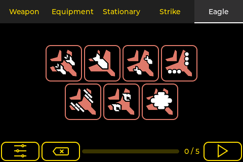

# HD2 Macropad

The most comfortable and easy-to-use Macropad for HELLDIVERS&trade; 2 for with live configuration for each drop into combat.

Get the game on [PS5](https://www.playstation.com/games/helldivers-2/) or [PC](https://store.steampowered.com/app/553850/HELLDIVERS_2/)

Based on an affordable IoT platform device with a capacitive touchscreen it's very handy for either PC or PS5 since it's connected via Bluetooth.

## Hardware

The device features a fully-fledged ESP32 called JC3248W535 from the manufacturer Shenzhen Jingcai Inteligent Co., Ltd

- CPU: ESP32-S3
- ROM: 16MB
- Display: 3.5" 480 x 320 IPS LCD with 65K Colors
- Audio: Pre-amplified speaker output
- TF Card slot
- Battery connector
- USB-C power supply

## Software

- IDE: [PlatformIO](https://platformio.org/)
- Board: [ESP32-S3](https://www.espressif.com/en/products/socs/esp32-s3)
- Framework: [ESP-IDF](https://docs.espressif.com/projects/esp-idf/en/stable/esp32/get-started/index.html)
- UI Editor: [Squareline Studio](https://squareline.io/)
- Libraries & functions
  -  [LVGL](https://lvgl.io/)
  - [BLE HID](https://docs.espressif.com/projects/esp-idf/en/stable/esp32/api-reference/bluetooth/esp_hidd.html)
  - [I2S Audio](https://docs.espressif.com/projects/esp-idf/en/stable/esp32/api-reference/peripherals/i2s.html)
 
## Screenshots

### Intro

### Setup

### Game

## Special thanks to

- [Icon Set](https://github.com/nvigneux/Helldivers-2-Stratagems-icons-svg) from [@nvigneux](https://github.com/nvigneux)
- [Demo project](https://github.com/NorthernMan54/JC3248W535EN) from [@NorthernMan54](https://github.com/NorthernMan54)

---
HELLDIVERS is a trademark of SONY INTERACTIVE ENTERTAINMENT LLC
