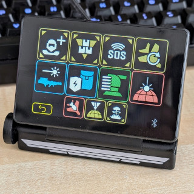

# HD2 Macropad

[Video preview](https://www.youtube.com/watch?v=zbW8vrxIuko) on YouTube.

A very comfortable and easy-to-use macropad for HELLDIVERS&trade; 2 for live configuration on each drop into combat with individual loadouts.

Get the game on [PC](https://store.steampowered.com/app/553850/HELLDIVERS_2/) or [PS5&trade;](https://www.playstation.com/games/helldivers-2/)

> [!IMPORTANT]  
> The device is not able to connect to the PS5&trade; directly. We're currently working on the [BT2USB bridge](https://github.com/unic8s/bt2usb_bridge) which plugs into the USB port of a PS5&trade; directly and connects to the HD2 Macropad via Bluetooth.

Based on an affordable IoT platform device with a capacitive touchscreen it's very handy for a PC or PS5&trade; since it's connected via Bluetooth as a keyboard input device.

> HELLDIVERS and PS5 are registered trademarks of SONY INTERACTIVE ENTERTAINMENT LLC.

## Prerequesites
- The specific device [JC3248W535](https://s.click.aliexpress.com/e/_DneMCLR)
- USB-C data cable to communicate with a PC for flashing the firmware once. After successful operation the device will connect only via Bluetooth.
- Normal users
  - Web browser ([Google Chrome](https://www.google.com/intl/en_us/chrome/) or [Microsoft Edge](https://www.microsoft.com/en-us/edge/)) for uploading the firmware to the device
- Pro users
  - [esp-tool](https://github.com/espressif/esptool) to upload the firmware
- Sound output (optional)
  - SD Card with minimum 2 MB free space
  - Speaker with [JST](https://en.wikipedia.org/wiki/JST_connector) connector. Our suggestion would be a [slim speaker with the right connector](https://s.click.aliexpress.com/e/_DkaGKst).
- [BT2USB bridge](https://github.com/unic8s/bt2usb_bridge) (for PS5&trade; support)

## Installation

The firmware is already pre-built available in our release section. Just go ahead and download your prefered version (we surely recommend to use the lastest one).
Please follow the described steps and make your decision if you'd like to add audio support with a SD card, the mandatory assets and a speaker attached to the device.

### Firmware
1. Download the [lastest BIN file](https://github.com/unic8s/hd2_macropad/releases/latest/download/hd2_macropad.bin) or your prefered [release](https://github.com/unic8s/hd2_macropad/releases)
2. Connect device to PC via USB-C data cable
3. Firmware upload...
- Normal users
  - Visit the [ESP Tool](https://espressif.github.io/esptool-js/)
  - Click the "Connect" button and select the correct device from the shown list
  - Change the "Flash Address" to 0x0
  - Select the BIN file and upload it to your device
- Pro users
  - Use "esptool" (Python) to [flash](https://docs.espressif.com/projects/esptool/en/latest/esp32/esptool/flashing-firmware.html) the BIN to your device
  - Use "Flash download tool" (Windows only) to [flash](https://docs.espressif.com/projects/esp-test-tools/en/latest/esp32/production_stage/tools/flash_download_tool.html) the BIN to your device
### Sounds (optional)
3. Unpack and copy all [assets](https://github.com/unic8s/hd2_macropad/releases/latest/download/assets.zip) to a SD card into the root directory
4. Connect a speaker to the rear [JST](https://en.wikipedia.org/wiki/JST_connector) port of the device. We use a [slim speaker with the right connector](https://s.click.aliexpress.com/e/_DkaGKst).

## Setup

In general there is no specific further configuration needed. You only have to pair the device with your PC and it's ready to use already.
Please follow the specific steps for your prefered system.

### PC

1. Connect HD2 Macropad to a power source (either USB-C or battery)
2. [Pair a Bluetooth device in Windows](https://support.microsoft.com/en-us/windows/pair-a-bluetooth-device-in-windows-2be7b51f-6ae9-b757-a3b9-95ee40c3e242)

### PS5

1. Connect HD2 Macropad to a power source (either USB-C or battery)
2. Connect [BT2USB bridge](https://github.com/unic8s/bt2usb_bridge) into the PS5 USB port

## 3D printing

The case on the photo is 3D printed and fits perfectly to the [JC3248W535](https://s.click.aliexpress.com/e/_DneMCLR).
Instructions for printing and assembling go along with STL files on...

- [Thingiverse](https://www.thingiverse.com/thing:6861703)
- [Printables](https://www.printables.com/model/1100588-hd2-macropad-stand)

## Stratagem selection

### First startup
1. After the intro screen all stratagems are displayed in groups (weapons, equipment, stationary, strike and eagle)
2. Select a stratagems by clicking on it. The yellow border will turn into a white one which indicates the selection.
3. You have to pick your 4 specific stratagems from the groups.
4. The label and the bar at the bottom of the screen shows the progress of your selection.
- After 4 stratagems have been selected the screen switches from the setup to game mode.
- If you want to switch to gaming mode with less than 4 stratagems select just click the "Play" button

### In-game usage
- The 4 upper stratagems are the basic items for all operation types (reinforce, resupply, SOS, rearm eagle).
- The 4 middle stratagems are the ones you selected in the setup procedure.
- The 2 lower stratagems are typical items for most operations (S.E.A.F. artillery, hellbomb).
- Just click a strategem to activate the execution of the macro.
- The Bluetooth icon in the lower right corner indicates the connection stats.
  -  disconnected
  -  connected

### Change selection
1. If you want to change your selection just click the "back" button at the bottom left corner.
2. You screen will switch back from game to setup mode.
3. Now you can either unselect the unwanted stratagems inside the groups or just click "reset" at the bottom right corner to unselect all selected stratagems from the list.
4. As soon as you're finished just click the "Play" button or have selected 4 stratagems again and the screen will automatically switch from setup to game mode.

## Device configuration
If you click on "Config" on the setup screen you will enter the device configuration with specific hard-/software features.

### Menu
- [Back] Switch back to setup mode
- [Default] Resets ALL settings to the default values
- [Reboot] Restarts the device

### Display
- [Brightness] Set the brighness level of your screen (10 - 100%)
- [Flip 180°] Set the orientation of the screen from 0 to 180° flipped (Device need to be rebooted after changing this setting)

### Audio
- [Mute] En-/disable the sound output (Requires an external speaker to work)

### Input
- [Delay] Set the input delay of the Bluetooth keyboard (50 - 200ms). This has to be adjusted if there are issues with your Bluetooth receiver of the PC or PS5&trade;.
- [Keymap] Select between the most common keymaps: WASD or arrow keys. These will be used to execute the stratagem code sequences.
- [Test] Click this button to send a test input sequence "hello" to your receiving device PC or PS5&trade;.

## Q&A - Troubleshooting
### Bluetooth
- I can't see the "HD2 Macropad" in the bluetooth device list of my PC
  - Please try turning bluetooth off and on your PC and retry pairing
  - Please try it with another bluetooth USB stick - some BT USB sticks are a bit picky
- The bluetooth icon in the game screen is continously switching (gray/blue)
  - Please unpair the device from your PC and pair it again

## Hardware - for enthusiasts

The device features a fully-fledged ESP32 called [JC3248W535](https://s.click.aliexpress.com/e/_DneMCLR) from the manufacturer [Shenzhen Jingcai Inteligent Co., Ltd](https://www.displaysmodule.com/)

- CPU: Espressif [ESP32-S3](https://www.espressif.com/en/products/socs/esp32-s3)
- PSRAM: 8MB
- Flash: 16MB
- Display: 3.5" 480 x 320 IPS LCD with 65K Colors
- Touch: Capacitive multitouch
- Connectivity: WiFi + Bluetooth
- Audio: Pre-amplified speaker output (mono) on 2-pin [JST](https://en.wikipedia.org/wiki/JST_connector) connector
- Memory: TF Card slot
- Power supply: USB-C (also data transfer)
- Battery: 2-pin [JST](https://en.wikipedia.org/wiki/JST_connector) connector

There is no speaker included in  the casing of the device. As a speaker you should ideally use a broandband driver with a small and slim casing.

- [SHEVCHENKO speaker](https://s.click.aliexpress.com/e/_DkaGKst) w 20 * h 35 * d 3.5 mm with a cable and a [JST](https://en.wikipedia.org/wiki/JST_connector) connector

## Software - for developers

- IDE: [VSCode](https://code.visualstudio.com/) + [PlatformIO](https://platformio.org/)
- Board: [ESP32-S3](https://www.espressif.com/en/products/socs/esp32-s3)
- Framework: [ESP-IDF](https://docs.espressif.com/projects/esp-idf/en/stable/esp32/get-started/index.html)
- UI Editor: [Squareline Studio](https://squareline.io/)
- Libraries & functions
  - [LVGL](https://lvgl.io/)
  - [BLE HID](https://docs.espressif.com/projects/esp-idf/en/stable/esp32/api-reference/bluetooth/esp_hidd.html)
  - [I2S Audio](https://docs.espressif.com/projects/esp-idf/en/stable/esp32/api-reference/peripherals/i2s.html)
- Programming languages & build tools
  - [C](https://en.wikipedia.org/wiki/C_(programming_language))
  - [Python](https://www.python.org/)
  - [CMake](https://cmake.org/)

## Disclaimer and copyright
> This is a private opensource project and is not associated in any kind with SONY INTERACTIVE ENTERTAINMENT LLC.
> SONY INTERACTIVE ENTERTAINMENT LLC is not responsible for any function and content that is related to this project.
> Related assets in this project are either produced by us and free to use for non-commercial usage or respectively published by the owners mentioned here.

## Credits and special thanks

- [Icon Set](https://github.com/nvigneux/Helldivers-2-Stratagems-icons-svg) from [@nvigneux](https://github.com/nvigneux)
- [Demo project](https://github.com/NorthernMan54/JC3248W535EN) from [@NorthernMan54](https://github.com/NorthernMan54)

## Screenshots

### Intro

### Setup

### Config

### Game (example configuration)

