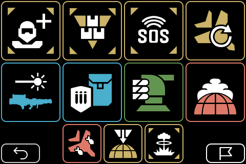

# HD2 Macropad

A very comfortable and easy-to-use macropad for HELLDIVERS&trade; 2 for live configuration on each drop into combat with individual loadouts.

Get the game on [PS5](https://www.playstation.com/games/helldivers-2/) or [PC](https://store.steampowered.com/app/553850/HELLDIVERS_2/)

Based on an affordable IoT platform device with a capacitive touchscreen it's very handy for either PC or PS5 since it's connected via Bluetooth as a keyboard input device.

> HELLDIVERS is a trademark of SONY INTERACTIVE ENTERTAINMENT LLC

## Installation

### Firmware
1. Download the [lastest BIN file](https://github.com/unic8s/hd2_macropad/releases/latest/download/hd2_macropad.bin) or your prefered [release](https://github.com/unic8s/hd2_macropad/releases)
2. Visit the [ESP Tool](https://espressif.github.io/esptool-js/) and upload the BIN file to your device
### Sounds (optional)
3. Unpack and copy all [assets](https://github.com/unic8s/hd2_macropad/releases/latest/download/assets.zip) to a SD card into the root directory
4. Connect a speaker to the rear port of the device

## Hardware specs - for enthusiasts

The device features a fully-fledged ESP32 called [JC3248W535](https://s.click.aliexpress.com/e/_DneMCLR) from the manufacturer [Shenzhen Jingcai Inteligent Co., Ltd](https://www.displaysmodule.com/)

- CPU: Espressif ESP32-S3
- ROM: 16MB
- Display: 3.5" 480 x 320 IPS LCD with 65K Colors
- Touch: Capacitive multitouch
- Connectivity: WiFi + Bluetooth
- Audio: Pre-amplified speaker output (mono)
- Memory: TF Card slot
- Power supply: USB-C (also data transfer)
- Battery: 2-pin connector

## Software setup - for developers

- IDE: [VSCode](https://code.visualstudio.com/) + [PlatformIO](https://platformio.org/)
- Board: [ESP32-S3](https://www.espressif.com/en/products/socs/esp32-s3)
- Framework: [ESP-IDF](https://docs.espressif.com/projects/esp-idf/en/stable/esp32/get-started/index.html)
- UI Editor: [Squareline Studio](https://squareline.io/)
- Libraries & functions
  -  [LVGL](https://lvgl.io/)
  - [BLE HID](https://docs.espressif.com/projects/esp-idf/en/stable/esp32/api-reference/bluetooth/esp_hidd.html)
  - [I2S Audio](https://docs.espressif.com/projects/esp-idf/en/stable/esp32/api-reference/peripherals/i2s.html)
 
## Credits and special thanks

- [Icon Set](https://github.com/nvigneux/Helldivers-2-Stratagems-icons-svg) from [@nvigneux](https://github.com/nvigneux)
- [Demo project](https://github.com/NorthernMan54/JC3248W535EN) from [@NorthernMan54](https://github.com/NorthernMan54)
 
## Screenshots

### Intro

### Setup

### Game (example configuration)

